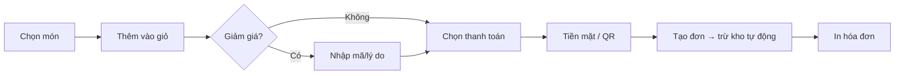

# 🏢 Smart Kids Coffee — Đặc tả Giao diện Quản trị (Admin Dashboard)

> **Phiên bản:** 1.0 — Ngày tạo: 08/05/2026
> **Mục đích:** Tài liệu đặc tả chi tiết toàn bộ các module của Giao diện Quản trị dành cho Admin/Quản lý, làm cơ sở triển khai code.
> **Đối tượng sử dụng:** Chủ quán (Admin), Quản lý ca (Manager).

---

## 📐 Tổng quan Kiến trúc

```text
Frontend (Port 3001)                    Backend (Port 3000)
┌─────────────────────┐                ┌─────────────────────┐
│  /dashboard         │  ── fetch ──►  │  /api/v1/overview    │
│  /dashboard/pos     │  ── fetch ──►  │  /api/v1/orders      │
│  /dashboard/products│  ── fetch ──►  │  /api/v1/products    │
│  /dashboard/hr      │  ── fetch ──►  │  /api/v1/employees   │
│  /dashboard/crm     │  ── fetch ──►  │  /api/v1/customers   │
│  /dashboard/settings│  ── fetch ──►  │  /api/v1/settings    │
└─────────────────────┘                └──────────┬──────────┘
                                                  │
                                          Supabase (PostgreSQL)
```

**Nguyên tắc:** Frontend chỉ hiển thị dữ liệu. Toàn bộ logic nghiệp vụ và truy vấn Database xử lý tại Backend API.

---

## 📊 Module 1: Bảng điều khiển trung tâm (Dashboard Overview)

**Route:** `/dashboard`
**API:** `GET /api/v1/overview/today` · `GET /api/v1/overview/chart`
**Mục tiêu:** Admin mở lên là nắm được TOÀN BỘ tình hình trong 5 giây.

### 1.1 Thẻ chỉ số tức thời (KPI Cards)

| Chỉ số | Mô tả | Nguồn dữ liệu |
|--------|--------|----------------|
| 💰 Doanh thu hôm nay | Tổng `total_amount` các đơn `completed` | `orders` |
| 🧾 Số hóa đơn | Đếm số đơn `completed` trong ngày | `orders` |
| 👶 Khách khu vui chơi | Số vé chưa hết hạn (chưa check-out) | `playground_tickets` *(mới)* |
| 📊 So sánh hôm qua | % tăng/giảm so với cùng kỳ hôm qua | `orders` |

### 1.2 Biểu đồ

| Biểu đồ | Loại | Ghi chú |
|----------|------|---------|
| Doanh thu 7 ngày gần nhất | Bar Chart (Recharts) | Tách 2 màu: Cafe (Xanh) vs Vé vui chơi (Hồng) |
| Doanh thu theo giờ trong ngày | Area Chart | Giúp biết khung giờ cao điểm để bố trí nhân sự |
| Top 5 món bán chạy | Horizontal Bar | Hiển thị tên món + số lượng |

### 1.3 Bảng cảnh báo (Alerts Panel)

| Cảnh báo | Điều kiện kích hoạt | Mức độ |
|----------|----------------------|--------|
| 🔴 Nguyên liệu sắp hết | `current_stock` <= `min_stock_alert` | Khẩn cấp |
| 🟡 Nhân viên đi trễ | `check_in` > giờ bắt đầu ca + 15 phút | Cảnh báo |
| 🟠 Đơn chưa thanh toán | `status` = `pending` quá 30 phút | Cảnh báo |

> [!TIP]
> **Góp ý kinh doanh:** Thêm biểu đồ "Doanh thu theo giờ" cực kỳ quan trọng. Nó giúp bạn biết khung giờ nào đông khách nhất để bố trí đúng số lượng nhân viên, tránh lãng phí lương.

---

## 🛒 Module 2: Hệ thống POS (Point of Sale)

**Route:** `/dashboard/pos`
**API:** `POST /api/v1/orders` · `PATCH /api/v1/orders/:id`
**Mục tiêu:** Nhân viên thu ngân thao tác nhanh nhất có thể, tối đa 3 click để hoàn thành 1 đơn.

### 2.1 Giao diện POS

```text
┌──────────────────────────────┬────────────────────┐
│                              │                    │
│   [Danh mục] [Tìm kiếm]     │   🛒 GIỎ HÀNG     │
│                              │                    │
│   ┌──────┐ ┌──────┐ ┌─────┐ │   Cafe sữa  x2    │
│   │ Cafe │ │ Trà  │ │ Kem │ │   Vé 2h     x1    │
│   │ Sữa  │ │ Đào  │ │ Vani│ │   ──────────────   │
│   │ 35k  │ │ 30k  │ │ 25k │ │   Tổng: 100,000   │
│   └──────┘ └──────┘ └─────┘ │   Giảm:  10,000   │
│                              │   ══════════════   │
│   ┌──────┐ ┌──────┐         │   THANH TOÁN:      │
│   │ Vé   │ │ Vé   │         │      90,000 ₫     │
│   │ 1h   │ │ 2h   │         │                    │
│   │ 50k  │ │ 80k  │         │   [💵 Cash] [📱QR] │
│   └──────┘ └──────┘         │   [🖨️ In Bill]     │
└──────────────────────────────┴────────────────────┘
```

### 2.2 Luồng nghiệp vụ



### 2.3 Tính năng chi tiết

- [ ] Grid sản phẩm: Hiển thị ảnh + giá, nhấn để thêm vào giỏ
- [ ] Tìm kiếm nhanh: Gõ tên món để lọc
- [ ] Giỏ hàng: Tăng/giảm số lượng, xóa món, ghi chú đặc biệt
- [ ] Giảm giá: Nhập % hoặc số tiền cố định + lý do
- [ ] Thanh toán: Tiền mặt (nhập số tiền nhận, tính tiền thừa) hoặc QR
- [ ] In hóa đơn: Kết nối máy in nhiệt / xuất PDF
- [ ] Trừ kho tự động: Khi đơn `completed`, trừ nguyên liệu theo công thức

> [!IMPORTANT]
> **Góp ý kinh doanh:** Thêm tính năng "Combo" rất quan trọng. Ví dụ: "Cafe + Vé vui chơi 2h = 100k" thay vì mua lẻ 35k + 80k = 115k. Đây là chiến lược upsell hiệu quả cho mô hình Cafe + Playground.

---

## 📦 Module 3: Quản lý Sản phẩm & Kho hàng (Inventory)

**Route:** `/dashboard/products` · `/dashboard/inventory`
**API:** `CRUD /api/v1/products` · `CRUD /api/v1/ingredients` · `POST /api/v1/inventory/import`

### 3.1 Quản lý Menu & Vé

| Tính năng | Mô tả | Trạng thái |
|-----------|--------|------------|
| CRUD Danh mục | Thêm/sửa/xóa Category (Cafe, Trà, Kem, Vé) | ☐ |
| CRUD Sản phẩm | Tên, giá, giá cuối tuần, ảnh, trạng thái | ☐ |
| Sắp xếp thứ tự | Kéo thả để thay đổi vị trí hiển thị | ☐ |
| Ẩn/Hiện nhanh | Toggle `is_available` ngay trên danh sách | ☐ |

### 3.2 Quản lý Nguyên vật liệu

| Tính năng | Mô tả | DB Field |
|-----------|--------|----------|
| Danh sách NVL | Tên, đơn vị, tồn kho, mức cảnh báo | `ingredients` |
| Nhà cung cấp | Tên NCC, liên hệ | `ingredients.supplier` |
| Giá nhập | Chi phí trên đơn vị | `ingredients.cost_per_unit` |
| Cảnh báo tồn kho | Thanh progress bar đổi màu khi gần hết | `min_stock_alert` |

### 3.3 Nhập/Xuất kho

- [ ] **Nhập kho:** Chọn NVL → Nhập số lượng + đơn giá → Ghi nhận `inventory_logs` (type: `import`)
- [ ] **Xuất kho (thủ công):** Hao hụt, đổ vỡ → Ghi nhận `inventory_logs` (type: `adjust`)
- [ ] **Lịch sử kho:** Bảng log toàn bộ biến động kho, lọc theo ngày/NVL/nhân viên thao tác

### 3.4 Công thức định lượng (Recipe) ⭐

> [!WARNING]
> **Cần tạo bảng mới `product_recipes`:** Schema hiện tại chưa có bảng này.

```sql
-- Bảng mới cần tạo
CREATE TABLE product_recipes (
  id UUID PRIMARY KEY DEFAULT gen_random_uuid(),
  product_id UUID REFERENCES products(id),
  ingredient_id UUID REFERENCES ingredients(id),
  quantity_needed DECIMAL NOT NULL,  -- Lượng NVL cần cho 1 sản phẩm
  unit VARCHAR(20) NOT NULL
);

-- Ví dụ: 1 ly Cafe sữa
-- product_id: "cafe-sua", ingredient_id: "cafe-hat", quantity_needed: 20, unit: "g"
-- product_id: "cafe-sua", ingredient_id: "sua-dac", quantity_needed: 30, unit: "ml"
```

**Luồng trừ kho tự động:**
1. POS tạo đơn hàng (Order) với 2 ly Cafe sữa
2. Backend nhận đơn → Tra bảng `product_recipes`
3. Tự động trừ: Cafe hạt (-40g), Sữa đặc (-60ml)
4. Ghi log vào `inventory_logs` (type: `export`, reference_id = order_id)
5. Nếu tồn kho < `min_stock_alert` → Push cảnh báo lên Dashboard

> [!TIP]
> **Góp ý kinh doanh:** Thêm tính năng **"Theo dõi hạn sử dụng"** cho nguyên liệu (sữa tươi, kem...). Sữa tươi chỉ dùng được 3-5 ngày. Hệ thống cảnh báo sắp hết hạn giúp tránh lãng phí và đảm bảo an toàn thực phẩm.

---

## 👥 Module 4: Quản lý Nhân sự (HR & Payroll)

**Route:** `/dashboard/hr` · `/dashboard/hr/payroll` · `/dashboard/hr/shifts`
**API:** `CRUD /api/v1/employees` · `POST /api/v1/attendance` · `GET /api/v1/payroll`

### 4.1 Quản lý nhân viên

- [ ] Danh sách: Avatar, tên, SĐT, phòng ban, trạng thái, ngày vào
- [ ] Thêm mới: Form nhập thông tin + tạo tài khoản hệ thống
- [ ] Sửa/Khóa: Cập nhật thông tin hoặc khóa tài khoản khi nghỉ việc
- [ ] Phân quyền: Gán role `admin` hoặc `staff` (quyết định menu nào được thấy)

### 4.2 Quản lý Ca làm việc (Shifts)

| Ca | Thời gian | Ghi chú |
|----|-----------|---------|
| 🌅 Sáng | 07:00 - 14:00 | Ca mở cửa |
| 🌤️ Chiều | 14:00 - 21:00 | Ca đông khách |
| 🌙 Tối | 17:00 - 22:00 | Ca cuối tuần/lễ |

- [ ] **Lên lịch:** Kéo thả nhân viên vào các ô ca trong tuần (Calendar View)
- [ ] **Chấm công:** Nhân viên check-in/check-out qua hệ thống (mã PIN hoặc nút bấm)
- [ ] **Đi trễ/Về sớm:** Tự động tính toán và highlight màu đỏ

### 4.3 Tính lương (Payroll)

**Công thức:**
```
Lương thực nhận = (Số giờ làm × Lương/giờ) + (Giờ OT × Lương OT) + Thưởng - Khấu trừ
```

- [ ] Tự động tổng hợp từ bảng `attendance` theo tháng
- [ ] Admin duyệt bảng lương trước khi chốt (`draft` → `approved` → `paid`)
- [ ] Xuất file Excel bảng lương

> [!TIP]
> **Góp ý kinh doanh:** Thêm tính năng **"Quản lý nghỉ phép"** (Leave Management). Mỗi nhân viên có số ngày phép/năm. Khi xin nghỉ, Admin duyệt trên hệ thống. Điều này cực kỳ cần thiết khi quán có từ 5 nhân viên trở lên.

---

## 🎠 Module 5: Quản lý Khu Vui Chơi (Playground) ⭐ MỚI

> [!IMPORTANT]
> **Đây là module đặc thù mà hầu hết phần mềm POS thông thường không có.** Vì Smart Kids là quán Cafe KẾT HỢP khu vui chơi, module này tạo ra lợi thế cạnh tranh lớn.

**Route:** `/dashboard/playground`
**API:** `CRUD /api/v1/playground`

> [!WARNING]
> **Cần tạo bảng mới `playground_tickets`:** Schema hiện tại chưa có bảng này.

```sql
CREATE TABLE playground_tickets (
  id UUID PRIMARY KEY DEFAULT gen_random_uuid(),
  order_id UUID REFERENCES orders(id),
  child_name VARCHAR(100),
  guardian_phone VARCHAR(20),
  check_in TIMESTAMPTZ DEFAULT NOW(),
  check_out TIMESTAMPTZ,
  ticket_type VARCHAR(20), -- '1h', '2h', 'unlimited', 'monthly'
  expires_at TIMESTAMPTZ,
  status VARCHAR(20) DEFAULT 'active' -- 'active', 'expired', 'checked_out'
);
```

### 5.1 Tính năng

- [ ] **Bảng trạng thái trực tiếp:** Danh sách trẻ đang chơi (tên, SĐT phụ huynh, thời gian còn lại)
- [ ] **Cảnh báo hết giờ:** Countdown timer, thông báo khi vé sắp hết hạn (còn 10 phút)
- [ ] **Giới hạn sức chứa:** Cấu hình số trẻ tối đa (ví dụ: 30 bé). Khi đầy, POS không cho bán thêm vé
- [ ] **Check-out:** Đánh dấu trẻ đã ra khỏi khu vui chơi

> [!TIP]
> **Góp ý kinh doanh:** Tính năng "Giới hạn sức chứa" không chỉ là về UX mà còn là **yêu cầu pháp lý về an toàn trẻ em**. Đảm bảo bạn luôn kiểm soát được số lượng trẻ trong khu vui chơi tại mọi thời điểm.

---

## 🤝 Module 6: Chăm sóc Khách hàng (CRM & Loyalty)

**Route:** `/dashboard/crm`
**API:** `CRUD /api/v1/customers`

> [!WARNING]
> **Cần tạo bảng mới:** `customers` và `loyalty_transactions`.

```sql
CREATE TABLE customers (
  id UUID PRIMARY KEY DEFAULT gen_random_uuid(),
  full_name VARCHAR(100) NOT NULL,
  phone VARCHAR(20) UNIQUE NOT NULL,
  email VARCHAR(100),
  children_info JSONB,        -- [{name: "Bé An", dob: "2020-01-15"}]
  loyalty_points INT DEFAULT 0,
  membership_tier VARCHAR(20) DEFAULT 'silver', -- silver, gold, platinum
  total_spent DECIMAL DEFAULT 0,
  visit_count INT DEFAULT 0,
  created_at TIMESTAMPTZ DEFAULT NOW()
);

CREATE TABLE loyalty_transactions (
  id UUID PRIMARY KEY DEFAULT gen_random_uuid(),
  customer_id UUID REFERENCES customers(id),
  order_id UUID REFERENCES orders(id),
  points_change INT NOT NULL,   -- +10 (tích) hoặc -50 (đổi)
  reason VARCHAR(200),
  created_at TIMESTAMPTZ DEFAULT NOW()
);
```

### 6.1 Tính năng

- [ ] **Quản lý Hội viên:** Tên, SĐT, thông tin các bé (tên + ngày sinh)
- [ ] **Tích điểm tự động:** Mỗi 10,000₫ chi tiêu = 1 điểm
- [ ] **Hạng thành viên:** Silver (0-99 điểm) → Gold (100-499) → Platinum (500+)
- [ ] **Đổi thưởng:** 50 điểm = 1 ly cafe miễn phí, 100 điểm = 1 vé vui chơi 2h
- [ ] **Sinh nhật bé:** Hệ thống tự nhắc khi sinh nhật bé sắp đến → Gửi voucher

> [!TIP]
> **Góp ý kinh doanh:** Tính năng **"Sinh nhật bé"** là vũ khí marketing cực mạnh. Gửi tin nhắn: "Chúc mừng sinh nhật bé An! Smart Kids tặng bé 1 vé vui chơi miễn phí 🎂". Tỷ lệ khách quay lại từ chiến dịch này thường > 60%.

---

## ⚙️ Module 7: Cài đặt Hệ thống (Settings)

**Route:** `/dashboard/settings`
**API:** `GET/PUT /api/v1/settings`

### 7.1 Thông tin cửa hàng

- [ ] Tên quán, địa chỉ, SĐT, logo (hiển thị trên hóa đơn)
- [ ] Giờ mở cửa (theo ngày trong tuần)

### 7.2 Cấu hình tài chính

- [ ] Thuế VAT (%, mặc định 8%)
- [ ] Phí dịch vụ ngày lễ/Tết (%)
- [ ] Phương thức thanh toán: Bật/tắt QR Pay, thông tin tài khoản ngân hàng

### 7.3 Cấu hình phần cứng

- [ ] Máy in hóa đơn: Loại kết nối (USB/Bluetooth/Network), khổ giấy (58mm/80mm)
- [ ] Máy in tem pha chế: Dùng cho quầy bar, in tên món + ghi chú

### 7.4 Phân quyền & Bảo mật

- [ ] Quản lý tài khoản nhân viên (đổi mật khẩu, khóa tài khoản)
- [ ] Nhật ký hoạt động (Audit Log): Ai đã làm gì, lúc nào
- [ ] Sao lưu dữ liệu (Export toàn bộ ra CSV/Excel)

---

## 🗄️ Tóm tắt Database cần bổ sung

Schema hiện tại đã có 11 bảng. Để triển khai đầy đủ các module trên, cần **tạo thêm 3 bảng mới**:

| Bảng mới | Module | Mục đích |
|----------|--------|----------|
| `product_recipes` | Inventory | Công thức NVL cho từng sản phẩm (trừ kho tự động) |
| `playground_tickets` | Playground | Theo dõi trẻ em trong khu vui chơi |
| `customers` + `loyalty_transactions` | CRM | Quản lý hội viên và tích điểm |

---

## 🚦 Thứ tự triển khai đề xuất (Roadmap)

| Giai đoạn | Module | Lý do ưu tiên | Thời gian |
|-----------|--------|----------------|-----------|
| **Phase 1** | POS + Menu + Kho cơ bản | **Cốt lõi kinh doanh** — Không có POS thì không bán được hàng | 2-3 tuần |
| **Phase 2** | Dashboard Overview | Cần dữ liệu từ POS để hiển thị biểu đồ | 1 tuần |
| **Phase 3** | Playground Management | **Đặc thù mô hình** — Tạo khác biệt với phần mềm POS thông thường | 1 tuần |
| **Phase 4** | HR & Payroll | Quan trọng khi có từ 5 nhân viên trở lên | 1-2 tuần |
| **Phase 5** | CRM & Loyalty | Giữ chân khách hàng, tăng doanh thu dài hạn | 1 tuần |
| **Phase 6** | Settings & Polish | Hoàn thiện, tối ưu, kiểm thử | 1 tuần |

> [!IMPORTANT]
> **Lời khuyên từ góc nhìn kinh doanh:** Hãy triển khai POS trước và đưa vào sử dụng thực tế ngay. Dữ liệu thực từ việc bán hàng hàng ngày sẽ giúp bạn thiết kế Dashboard và Báo cáo chính xác hơn nhiều so với việc "tưởng tượng" dữ liệu.
